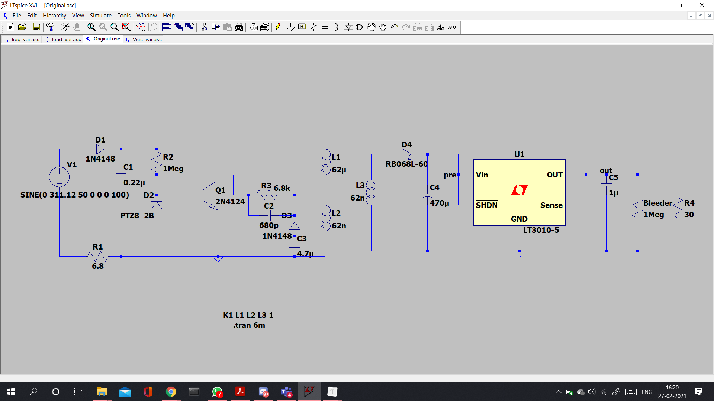
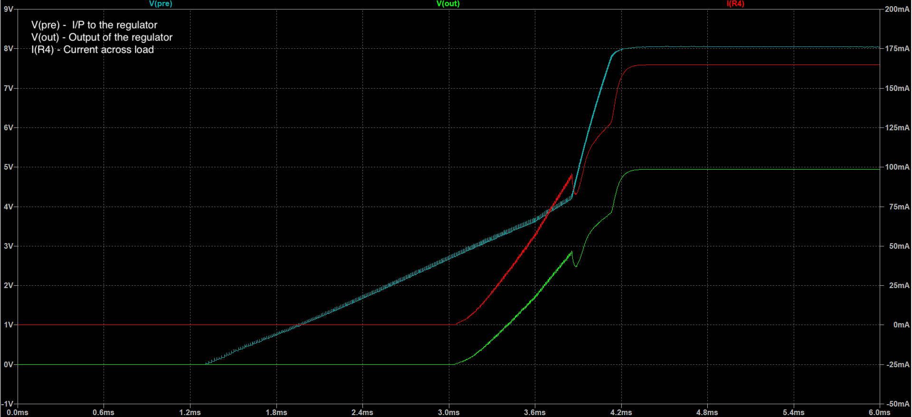
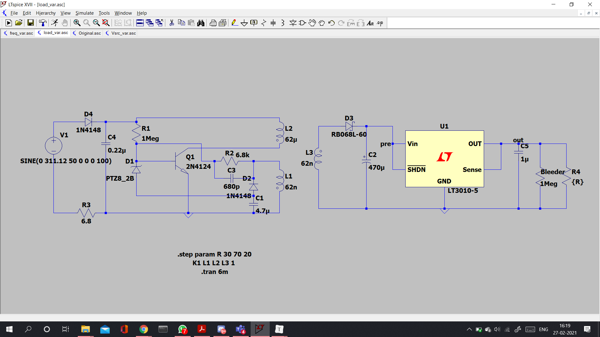
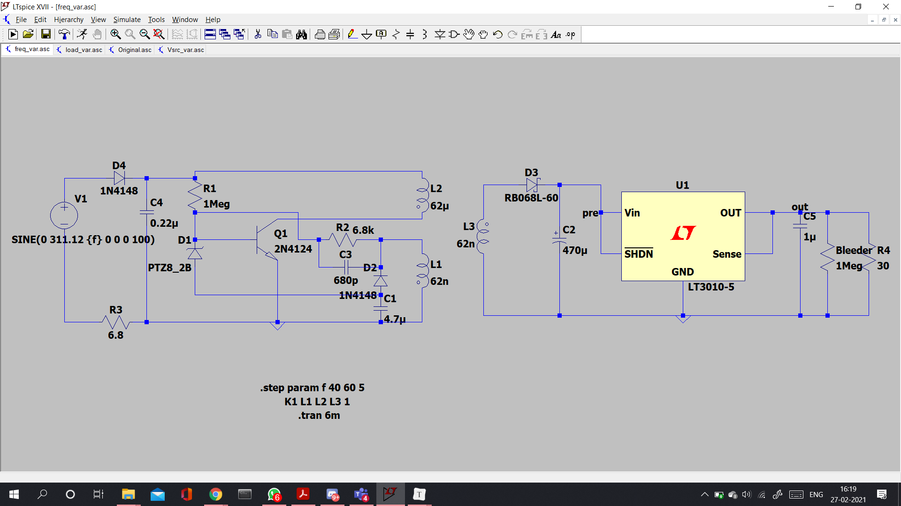
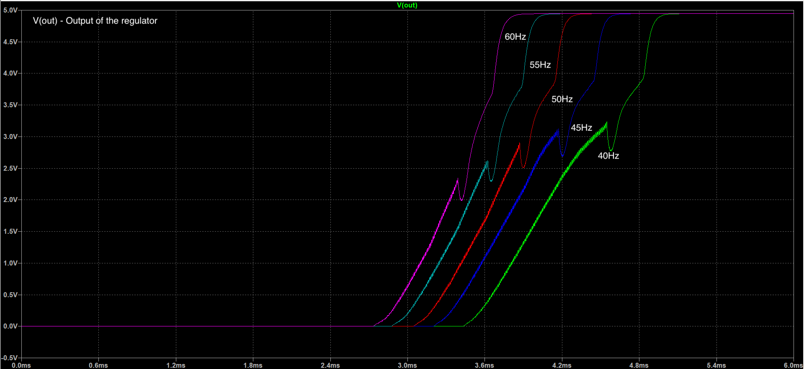
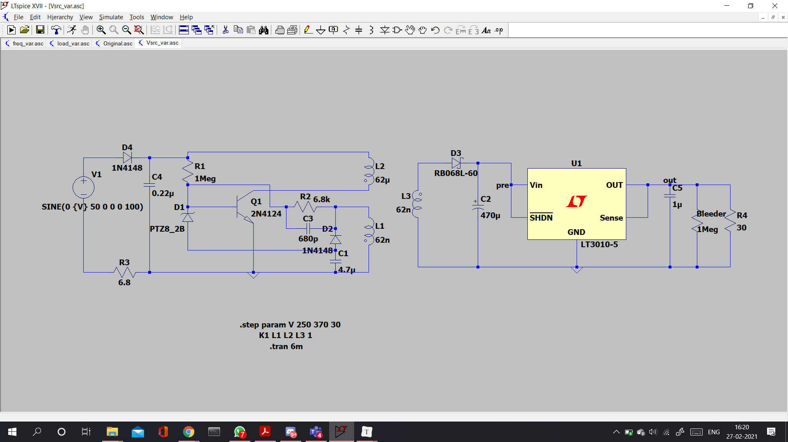
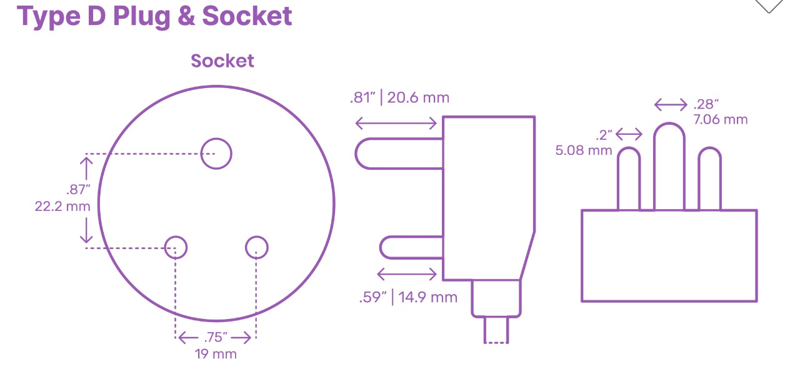

# Design and Systems Laboratory

**Submitted by - Team B**

(Lead Coordinator - Shauryasikt Jena)

## Assignment 2: AC-DC Rectifier Circuit as a Mobile Phone Charger

### Aim

Designing an AC - DC rectifier to charge mobile phone and producing a regulated output voltage of 5V.

### Equipment Required for the Charger

Contemporary phone chargers almost universally supply a constant charging DC supply of 5V to the phone (except for some Warp chargers where it goes up to 12V but might be detrimental to the batteries of normal phones). Keeping this in mind, the charger is required to give a 5V DC supply, not lose much power when it is plugged in but the phone (load) is not connected, and not heat up internally. Moreover, all the internal circuitry of the charger should fit within a standard *1in x 2in x 2in* enclosure with 2 round pins to go into the socket and a USB type-C port for the charging cable. Thus, the following will be required:

* **Electrical Requirements:**
  * **Input:** Be able to take AC Mains 220V 50Hz supply
  * **Output:** Be insensitive to minor fluctuations in input (~5% in frequency, ~20% in Source voltage)
  * **Power Losses:** Minimize heat losses across resistors and flux leakage across inductors
  * **Component Size:** Employ miniscule components to be fit into a practical charger case
* **Mechanical Requirements:**
  * **Detachable cable with USB Type C (Micro USB) at output:** In the proposed solution, since the maximum output current is 3A, we need a USB Type C (maximum 3A, 5V). Hence it would help in power charging.
  * Detachable cable with USB A 2.0 input port
  * **Plug type:** C plug type with two round pins is recommended for Indian households.
  * **Weight:** For a portable and handy charger, it is recommended that the weight remains less than 210gms.
  * **Positioning:** Transformer near the input mains while the rest of the circuit towards the end of the charger to ensure minimum power loss.
  * **Specifications of the wires**:
    * **Nylon braided cable:** For better mechanical support and EM interference protection.
    * **22 AWG:** This eliminates distance restrictions and provides full charging power up to 2 metres.
    * **5.2-5.5mm diameter:** As the thickness of the wires increases, the resistance decreases, resulting in large current flows. This wire thickness is supported by a 22 gauge wire.
    * **Multi-stranded Copper wire:** These wires provide flexibility and prevent breaking after repeated bending.
    * **Maximum 1 Meters ( 2-3 feet) length of wires:** As the length of wire increases, the data transfer rate and charging speed decreases. An optimal choice is 3 feet or 0.9 metres.
    * **Shielding:** Aluminum Foil along with Braided shielding
    * **Jacket:** Polyvinyl Chloride
    * **plastic cable - Flex style strain relief grip**
    * **Ferrite bead:** This helps to reduce high frequency noise and could be optionally chosen along with the desired USB.

### Specifications

**Capacitors:**

|                         Component ID                         |             Standard Document Shortcut URL              |  Qty   | Cost per unit |   Sub-total   |
| :----------------------------------------------------------: | :----------------------------------------------------------: | :----: | :-----------: | :-----------: |
|       Tantalum Capacitors - Solid SMD 6.3V 470uF 2917        | [Here](https://www.mouser.in/datasheet/2/212/1/KEM_T2005_T491-1093550.pdf) | 48,000 |    ₹76.65     | ₹36,77,760.00 |
| Multilayer Ceramic Capacitors MLCC - SMD/SMT 6.3V 1uF 0603 X7R 0.1 | [Here](https://www.mouser.in/datasheet/2/212/1/KEM_C1013_X7R_FT_CAP_SMD-1103280.pdf) | 48,000 |     ₹6.64     | ₹3,18,720.00  |
| Multilayer Ceramic Capacitors MLCC - SMD/SMT 500V .22uF X7R 1812 10% Flex | [Here](https://www.mouser.in/datasheet/2/212/1/KEM_C1076_X7R_HV_AUTO_SMD-1093301.pdf) | 48,000 |    ₹18.12     | ₹8,69,760.00  |
| Multilayer Ceramic Capacitors MLCC - SMD/SMT 10V 680pF 0603 X7R 20% | [Here](https://www.mouser.in/datasheet/2/212/KEM_C1002_X7R_SMD-1102033.pdf) | 48,000 |     ₹3.07     | ₹1,47,360.00  |
| Multilayer Ceramic Capacitors MLCC - SMD/SMT 10V 4.7uF 0603 X5R 10% | [Here](https://www.mouser.in/datasheet/2/212/KEM_C1006_X5R_SMD-1103249.pdf) | 48,000 |    ₹12.99     | ₹6,23,520.00  |

**Inductors:**

| Component ID |             Standard Document Shortcut URL              |  Qty   | Cost per unit |   Sub-total   | Vendor URL                                                   |
| :----------: | :----------------------------------------------------------: | :----: | :-----------: | :-----------: | ------------------------------------------------------------ |
| 62n inductor | [Here](https://www.mouser.in/datasheet/2/418/5/ENG_DS_1773163_G-1627394.pdf) | 96,000 |    ₹76.65     | ₹36,77,760.00 | [Here](https://www.mouser.in/ProductDetail/Coilcraft/0603DC-62NXJRW/?qs=KUoIvG%2F9IlYMCp1E%2Fzd6AA%3D%3D#footnotes) |
| 62u inductor |  [Here](https://www.mouser.in/datasheet/2/3/ASPI-6045S-1775144.pdf)  | 48,000 | ₹17.89              | ₹8,94,500.00         | [Here](https://www.mouser.in/ProductDetail/ABRACON/ASPI-6045S-620M-T/?qs=sGAEpiMZZMv126LJFLh8y5rSMoBbIWHwPH9YLCO0CIQ%3D) |

**Resistors:**

| Component ID |             Standard Document Shortcut URL              |   Qty    | Cost per unit | Sub-total  |
| :----------: | :----------------------------------------------------------: | :------: | :-----------: | :--------: |
| **6.8k ohm** | [Here](https://www.mouser.com/catalog/specsheets/RC0603.pdf) |  50,000  |     ₹0.49     | ₹24,500.00 |
| **6.8 ohm**  | [Here](https://www.mouser.in/datasheet/2/351/Royal_Electric_XC_600035-1893446.pdf) |  50,000  |     ₹0.73     | ₹36,500.00 |
|  **1M ohm**  | [Here](https://www.mouser.in/datasheet/2/414/RC-1666891.pdf) | 1,00,000 |     ₹0.05     | ₹5,000.00  |

**Diodes:**

| Component ID |             Standard Document Shortcut URL              |  Qty   | Cost per unit |  Sub-total   |
| :----------: | :----------------------------------------------------------: | :----: | :-----------: | :----------: |
|    1N4148    |  [Here](https://www.mouser.in/datasheet/2/308/1N914_D-1801484.pdf)  | 50,000 |    ₹0.511     |  ₹25,550.00  |
|   PTZ8_2B    | [Here](https://www.mouser.in/datasheet/2/348/ptzte258.2b-e-1017423.pdf) | 50,000 |    ₹10.15     | ₹5,32,875.00 |
|  RB068L-60   | [Here](https://www.mouser.in/ProductDetail/ROHM-Semiconductor/RB068L-60TE25/?qs=sErY3DeL0Tgmt9hYeTroUg%3D%3D) | 50,000 |       ₹11.17        |  ₹5,58,500           |

**ICs:**

| Component ID |            Standard Document Shortcut URL            |  Qty   | Cost per unit | Sub-total | Vendor URL                                                   |
| :----------: | :-------------------------------------------------------: | :----: | :-----------: | :-------: | ------------------------------------------------------------ |
|   LT3010-5   | [Here](https://www.mouser.in/datasheet/2/609/30105fe-1270239.pdf) | 50,000 |  ₹143.08             |    ₹7,154,000     | [Here](https://www.mouser.in/ProductDetail/Analog-Devices/LT3010HMS8E-5PBF/?qs=ytflclh7QUWo9pU51zrE6g%3D%3D) |

**Enclosure Components:**

| Component ID |             Standard Document Shortcut URL              |  Qty   | Cost per unit |  Sub-total   | Vendor URL |
| :----------: | :----------------------------------------------------------: | :----: | :-----------: | :----------: | ------------ |
|    Adapter    |  (needs to be updated)   | 50,000 |    ₹179.00     |  ₹8,950,000.00  | [Here](https://www.amazon.in/HTC-E250-Charger-Android-Devices/dp/B07HQCT46F/ref=sr_1_4?adgrpid=61815374787&dchild=1&ext_vrnc=hi&gclid=Cj0KCQiA7YyCBhD_ARIsALkj54rqn8syecSyGNqNak7b5byxzWUoXqPcPmcgD4PPOG8fnYhe7dkSx5QaArRcEALw_wcB&hvadid=294102505617&hvdev=c&hvlocphy=9062280&hvnetw=g&hvqmt=b&hvrand=2367711087430959562&hvtargid=kwd-23229876&hydadcr=5843_1738697&keywords=mobile+adapter&qid=1615021446&s=electronics&sr=1-4) |
|   Type C USB cable    |  (needs to be updated) | 50,000 |    ₹99.00     | ₹4,950,000.00 | [Here](https://www.amazon.in/Samsung-Galaxy-A8-Star-Charging/dp/B07Z6HVHG7/ref=asc_df_B07Z6HVHG7/?tag=googleshopdes-21&linkCode=df0&hvadid=397080880028&hvpos=&hvnetw=g&hvrand=16272771759156953333&hvpone=&hvptwo=&hvqmt=&hvdev=c&hvdvcmdl=&hvlocint=&hvlocphy=9062280&hvtargid=pla-915335027996&psc=1&ext_vrnc=hi) |
|  Charger PCB  |  (needs to be updated) | 50,000 |       ₹8.00        |  ₹4,00,000.00          | [Here](https://www.indiamart.com/proddetail/mobile-charger-pcb-board-10696862212.html) |

**Cost per piece: ₹664.19** (individually)

**Total cost for manufacturing 48,000 pieces: ₹26,407,655** => (individually ₹550.16)

### Theory

Mobile phone charger is a device commonly used to charge the mobile phones when powered by a  220V-50Hz AC supply. Typically, mobiles require a regulated DC voltage of ~ 5V in order to charge the battery. Hence, for a stable and efficient DC supply, the circuit must consist of a transformer, a half wave rectifier and a voltage regular.

* **Step Down Transformer:**
In order to convert a high alternating voltage of 220 V into low voltage, we need a step down transformer. In the current implementation, we need a highly compact transformer which ideally operates at a very high frequency AC current. To this end, we use a flyback oscillator. We use a transformer with ~ 250 turns on the enameled copper wire on the primary and 6 turns of the same on the secondary. SWG of the primary coil ranges between 36-40 while that of the secondary range between 26 to 28. This transformer also has an auxiliary feedback with roughly 8 to 15 turns of 36-40 SWG copper wire.

* **Ripple Filtration:**
The output from transformer involves large ripples and is unstable. In order to reduce the the ripple factor, a large shunt capacitor is used in parallel with the load. This acts as a filter since the capacitor charges and stores energy in the positive cycle, and discharges exponentially in negative wave cycle. Large capacitance increases the time constant for discharge. Hence, by the time the capacitor begins to discharge, a positive cycle begins leading to recharging. This results in an almost DC voltage with minimized ripples across the load.

* **Voltage Regulation**:
To produce a regulated DC output of 5V, we use a voltage regulator IC LT3010-5. This IC is a 50mA - Low Dropout Positive Regulator which works for an input range of 3V to 80V Also, it has an operating temperature range -65C to 150C built in with protection against excessive temperature. 

### Design choices and component selection

The process of converting a high voltage AC power supply to a low voltage DC power supply can be broken down into two steps:

* **AC to DC conversion:**

  The main circuit component used for AC to DC conversion is a rectifier. A rectifier is a circuit made up of a set of precisely arranged diodes followed by a low pass filter. The diodes are used to eliminate the negative half-cycles present in an AC input whereas the low pass filter eliminates all the higher-order harmonics present in its input signal. These two systems applied one after the other to the AC signal results in a DC output. Moreover, the half-wave rectifier produces desired results at the output end while occupying considerably less space than a full-wave rectifier. 

  A mobile phone charger is much more than a simple rectification circuit as there is a substantial difference between the input and output voltage. Rather than using a voltage divider which is extremely inefficient because most of the power is dissipated, a common and efficient way of stepping down an AC input is by using a transformer.

  Therefore a very rudimentary AC to DC converter which one can use to make a mobile phone charger is to use a transformer followed by a rectifier circuit. However, this approach is not well suited for making a compact mobile phone charger. This is because directly stepping down a 220V 50Hz mains supply would require a large and bulky transformer. This size relation is given by the fact that the size of the core of a transformer increases with an increase in peak flux value. The peak flux value is inversely proportional to the operational frequency of a transformer given by the formula:
  $$
  \phi_{max}= \frac{V}{\sqrt{2}\pi f N}
  $$
  Where **V** is the input peak voltage, **f** is the frequency of operation, **N** is the number of turns on the input side. For a 50Hz, 220V mains supply, peak flux value is high because of which transformers which can work in this input range are mostly bulky (a common 230V-12V, 36W single phase transformer operating at 50Hz typically weighing around a kilo).

  To eliminate this issue, a common trick which many modern chargers employ is to use an oscillator circuit (eg. a flyback oscillator). In essence, a self-oscillating flyback oscillator can be used to generate extremely high frequency pulses from a DC input, with the magnitude of the pulses being proportional to the DC input voltage. The circuit diagram of a self-oscillating flyback converter is very similar to that of a buck-boost converter, the main difference being an inductor split to make primary and auxiliary windings. The switching action is controlled by a capacitive circuit which is activated once the voltage on the primary windings is sufficiently high. The capacitive circuit charges quickly and eventually blocks the primary current, bringing the output to 0 volts. This triggers the discharging of the capacitive circuit, restoring the starting state. This action is repeated many times (~10K times), resulting in a very high frequency AC output.

  This suggests that a much better design choice described below:

1. Convert the AC mains supply to a DC voltage by a simple rectifier circuit

2. use the DC voltage generated in the previous step to run a self-oscillating flyback oscillator to generate high frequency AC voltage

3. step down the high frequency AC voltage using a step down transformer (which would now be much smaller due to the much higher frequency of operation)

4. rectify the final step down AC output to generate a DC voltage

   Finally, a Schottky diode is employed at the output for its low forward voltage drop and faster working at higher switching speeds. RB068L-60 is one such diode that functions as required in the provided input-output ranges.

* **DC regulation:**

  The only thing missing after the AC-DC conversion circuit is voltage regulation. Voltage regulation is crucial part of DC power supplies. The main need of a voltage regulator IC is to make sure that our circuit will faithfully give a constant output of desired voltage value for a wide range load applied to our circuit. We therefore use such an IC and our experiments confirm that our mobile phone charger is robust towards load variations.

- **Maintenance:**

  To ensure that the charger is not damaged when plugged in to the socket and not actively involved in charging the phone, we introduce a bleeder resistance to ensure smooth discharging of the capacitor with low power loss. One has to compromise between power consumption and the speed of bleeder resistor. A small valued resistor can provide high speed bleeding but the power consumed is higher. So it is up to the designer that how much manipulation is wanted. The resistor value must be high enough to not interfere with power supply and at the same time low enough to discharge the capacitor quickly.

  The formula to calculate the value of bleeder resistor is given as:

  $$
  R = -t / C*ln(V_{safe}/V_o)
  $$
  

  Here,  
  R = resistance = 1Meg 
  C = capacitance = 1uF Vsafe = safe voltage up to which it can be discharged = 0.5V Vo = initial voltage = 5V 
  which gives 
  t = discharge time = 0.43s 

### Circuit Schematic

```mermaid
    graph LR
    A[220V 50Hz AC] --> B(Half Wave rectification)
    B --> C(Filtering to a stable DC 310V)
    C --> D(Oscillating at the order of 10kHz)
    D --> E(Step Down Transformer to 8V AC)
    E --> F[Half Wave rectification]
    F --> G[Filtering to a stable DC 8V]
    G --> H[Reguated stable DC output of 5V]
```

We searched for a load that is close to a mobile phone but no clear solutions were available so the output end is a voltage source of 5V from which the phone is intelligently expected to draw sensible current: shown by the simulation of 30 ohm load with ~160mA current.

### Simulations for Input mains at 220V

### Load variation

Ideally, there should be infinite resistance at the output for the capacitor to discharge. Here, we tested by varying the output resistance between 30 Ohms to 70 Ohms. As the resistance increases, transient time reduces.

* Schematic

* Simulation

### Input Frequency variation

Since the input mains frequency varies ~5% of its standard value (50Hz), we tested by varying the input frequency in a range of 40Hz to 60Hz (20% variation). The current implementation is robust to such large variations in the input mains frequency. We observe that with an increase in the frequency, transient time reduces.

| Mains Frequency | 40Hz | 45Hz  | 50Hz | 55Hz | 60Hz |
| :-----------: | :--: | :--: | :--: | :--: | :--: | :--: |
| Transient Time |  5.1ms | 4.7ms | 4.5ms | 4.0ms  | 3.8ms|

* Schematic

* Simulation

### Sensitivity to input mains variation from 180V-260V

The proposed mobile charger is robust to input mains variations from 180V - 260V. This is because of the highly efficient LDO LT1085 Voltage regulator. Despite having a limited maximum operating voltage is limited, the devices can easily withstand transient input voltages up to 30V.

| Mains Voltage | 175V | 197V  | 219V | 241V | 263V |
| :-----------: | :--: | :--: | :--: | :--: | :--: | :--: |
| Transient Time |  5.7ms | 5.0ms | 4.5ms | 4.0ms  | 3.8ms|

* Schematic

* Simulation

## PCB design

Once our circuit schematic is ready, and its simulations are working- the next step in realizing the design is etching it on a printed circuit board (PCB). We prefer PCBs over other methods to drive and support the circuit because of the ease in scalability and building.

We use KiCAD to do PCB design considering the schematic as the basic plan. Now, for each component of the schematic we must define a *footprint*, i.e., the dimensions of the corresponding "real-life" variant of the component, along with the placement of pads to allow for soldering of component to PCB. Once these are set according to market-availability of the corresponding parts, we arrange these blocks on the PCB. 

Optimal placement on the PCB is important to ensure minimal interference. We start by making sure that components which perform similar functions are kept near each other (for eg. if we have a rectifier with a capacitor to handle the ripple, then we should keep the capacitor near the rectifier while doing PCB design). Moreover, we should make sure the 'flow' of the current in the circuit is as linear as possible (i.e. it goes from one side to the other). These steps are taken to ensure that the copper tracks are as short as possible, which would help us in avoiding electromagnetic noise, and is also important to minimize the weight of the board, and cost of fabrication.

The input is through a 2-pin socket adapter, and the output is taken through a USB Type-A port. In accordance with the datasheet, the TPS2514 IC (whose function is to communicate to connected device that our charger is a power device) has a capacitor close to it. The datasheets of all the components used can be accessed via the datasheets folder. Most parts used are surface mounted to avoid drilling the board for assembly, hence pin through components are connected on the backside to reduce clustering.

### Layered view of all PCB layers

### 3D / Plan / Elevation diagrams

    
    <figcaption align="center"> 3D View </figcaption>

  
    <figcaption align="center">Front View and Back View (L to R)</figcaption>

     
    <figcaption align="center">Side View 1 and Side View 2 (L to R)</figcaption>

    
    <figcaption align="center"> Top View </figcaption>

## Enclosure Design
Components : Plugs, Charger PCB, Adapter upper case, Adapter lower case, Type-C USB cable

* *Plug:*
  Plug is as per the standard Indian size. The live and neutral pins are 19 mm apart, earth pin is 22.2 mm above them. The length and thickness of the live and neutral pins are 14.9 mm and 5.08 mm respectively while for the earth wire they are 20.6 mm and 7.06 mm respectively. The plug is connected to the bottom of the PCB through wires.

* *Adapter case:*
  The adapter is designed to leave a 1 cm gap around the PCB. The dimensions are 33mm x 57mm x 67mm. The lower and upper halves are symmetric in external dimensions, but the lower half has screws to support the PCB. The adapter case would be made of ABS plastic due to its favorable mechanical properties such as impact resistance, toughness, and rigidity. It has a slot to insert the standard USB A pin.

* *Cable:*
  The cable is 30 cm long consisting of multi-stranded copper wires with Aluminum shielding and a PTFE jacket. It has a standard USB A pin on one end and a standard USB C pin on the other end.

**Charger:** 

    
    <figcaption align="center"> 3D view of Charger </figcaption>

    
    <figcaption align="center"> Charger Top View </figcaption>

    
    <figcaption align="center"> Charger Dimensions </figcaption>

  
    <figcaption align="center">Front View and Left View of Charger (L to R)</figcaption>

    
    <figcaption align="center"> Charger Components </figcaption>

   
    <figcaption align="center">Left View, Top View and Front View of Cable (L to R)</figcaption>

### Dimensions
Units are in millimeters throughout
* Charger Body-
    | Height | Width | Length |
    |------|:-----:|------:|
    | 33.0  | 57.00 |  67.00 |
* Pins (dimensions according to Type-D socket)
    * Distance between pins- 19.00
    * Length of each pin- 14.90
    * Diameter of each pin- 5.80 

### Materials
* Charger enclosure: ABS plastic or PVC
* Cable: PTFE(Polytetrafluoroethylene) or FEP(fluorinated ethylene propylene)
  

**Plug:**

## Translation of the constituent files

- Appropriate funds for skilled translators are instrumental in enabling us to render our report universally comprehensible.

- कुशल अनुवादकों के लिए उपयुक्त कोष हमारी रिपोर्ट को सार्वभौमिक रूप से प्रस्तुत करने में सक्षम बनाने में महत्वपूर्ण भूमिका निभाता है।

- કુશળ ભાષાંતરકારો માટે યોગ્ય ભંડોળ અમને અમારા અહેવાલને વૈશ્વિક રીતે સમજી શકાય તેવું યોગ્ય બનાવવા માટે મહત્વપૂર્ણ છે.

- आम्हाला आमचा अहवाल सर्वव्यापी समजण्यायोग्य बनविण्यासाठी सक्षम अनुवादकांसाठी योग्य निधी आवश्यक आहे

- Des fonds adaptés pour des traducteurs qualifiés sont importants pour nous permettre de rendre notre rapport compréhensible universellement.

- Los fondos apropiados para traductores calificados son importantes para permitirnos hacer que nuestro informe sea universalmente comprensible.

## Conclusion

We were able to design a 3D PCB model of a mobile phone charger based on an AC-DC rectifier, its schematic and run various simulations. Sensitivity checks were run to ensure that the charger provides a steady 5V DC charging supply despite fluctuations in source voltage amplitudes and frequency. All of this was accomplished within a compact board with minimized power and flux losses. Moreover, USB ports and charging pins were added to the model. 
The next aim is to fully prepare the charger by designing a suitable enclosure complete with assembly, and additional elements like a well-insulated charging cable and proper shields.

## References

List of references for components used in the circuit:

1. “Flyback Oscillator,” n.d. https://www.electroschematics.com/diy-rcc-smps-circuits/.

2. “USB Type-C,” n.d. https://en.wikipedia.org/wiki/USB-C.

3. “USB Connector,” August 2007. https://usb.org/sites/default/files/CabConn20.pdf.
