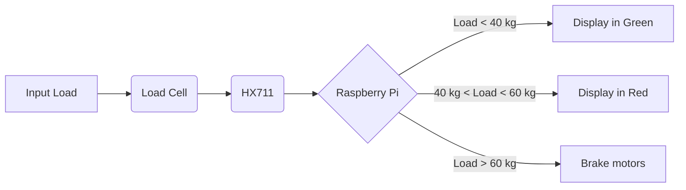
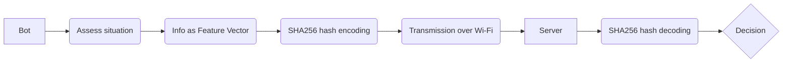
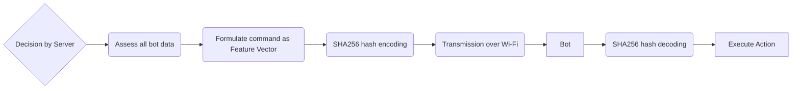

# ELP305: Design and Systems Laboratory &rarr

## Experiment #3: Add communication sub-systems, protocols between Mule-bots to enhance functionality

## Team B

### Table of Contents

[toc]

### Authors

|                                                     | Name                      | Contact              | Responsibility               | Entry Number |
| --------------------------------------------------- | ------------------------- | -------------------- | ---------------------------- | ------------ |
| Lead Coordinator                                    | Shauryasikt Jena          | ee1180500@iitd.ac.in | Organizing task distribution | 2018EE10500  |
| Activity Coordinator(s) Specifications : electrical | Anubhav Dubey             | ee3180529@iitd.ac.in | Elec Specs                   | 2018EE30529  |
|                                                     | Shresth Mehta             | ee3180564@iitd.ac.in | Elec Specs                   | 2018EE30564  |
| Activity Coordinator(s) Specifications : Mechanical | Sakshi Bhandari           | mt6180792@iitd.ac.in | Mech Specs                   | 2018MT60792  |
|                                                     | Ayush Srivastava          | mt1180747@iitd.ac.in | Mech Specs                   | 2018MT10747  |
| Activity Coordinator Requirements                   | Ishita Hans               | ee3180546@iitd.ac.in | Requirements 1               | 2018EE30546  |
|                                                     | Aditi Rai                 | mt1180736@iitd.ac.in | Requirements 1               | 2018MT10736  |
|                                                     | Kartikeya Rai             | mt6180811@iitd.ac.in | Requirements 1               | 2018MT60811  |
| Activity Coordinator Design                         | Siddhaant Priyam          | ee3180565@iitd.ac.in | Design 1                     | 2018EE30565  |
|                                                     | Adarsh Jain               | ee3180525@iitd.ac.in | Design 1                     | 2018EE30525  |
|                                                     | Silky Singh               | mt1180769@iitd.ac.in | Design 1                     | 2018MT10769  |
|                                                     | Kartik Agrawal            | ee1180472@iitd.ac.in | Design 1                     | 2018EE10472  |
|                                                     | Digvendra Singh Tomar     | ee3180539@iitd.ac.in | Design 1                     | 2018EE30539  |
| Activity Coordinator Documentation                  | Sharut Gupta              | mt6170250@iitd.ac.in | Docs 1                       | 2017MT60250  |
|                                                     | Hetvi Jethwani            | mt1180754@iitd.ac.in | Docs 1                       | 2018MT10754  |
|                                                     | Palak Jain                | mt1170742@iitd.ac.in | Docs 1                       | 2017MT10742  |
|                                                     | Amogh Agrawal             | ee1180441@iitd.ac.in | Docs 1                       | 2018EE10441  |
|                                                     | Anchit Tandon             | mt1170751@iitd.ac.in | Docs 1                       | 2017MT10772  |
| Activity Coordinator Design + Doc                   | Uddharsh Kotahwala        | mt1180771@iitd.ac.in | Des + Docs 1                 | 2018MT10771  |
|                                                     | Mrinal Thakar             | ee3180921@iitd.ac.in | Des + Docs 1                 | 2018EE30921  |
|                                                     | Khushi Pathak             | mt6180783@iitd.ac.in | Des + Docs 1                 | 2018MT60783  |
|                                                     | Aryan Agarwal             | mt1180744@iitd.ac.in | Des + Docs 1                 | 2018MT10744  |
|                                                     | Ritvik Ajaria             | mt1180766@iitd.ac.in | Des + Docs 1                 | 2018MT10766  |
| Activity Coordinator Requirements                   | Aniket Shetty             | ee1180443@iitd.ac.in | Requirements 2               | 2018EE10443  |
|                                                     | Mridul Ahuja              | mt1180626@iitd.ac.in | Requirements 2               | 2018MT10626  |
|                                                     | Himanshu Singh Yadav      | mt1170731@iitd.ac.in | Requirements 2               | 2017MT10731  |
| Activity Coordinator Design                         | Misha Mishra              | ee3180624@iitd.ac.in | Design 2                     | 2018EE30624  |
|                                                     | Rachit Mittal             | mt1180764@iitd.ac.in | Design 2                     | 2018MT10764  |
|                                                     | Bhumika Chopra            | mt1180748@iitd.ac.in | Design 2                     | 2018MT10748  |
|                                                     | Kushagra Singh Saini      | ee3180553@iitd.ac.in | Design 2                     | 2018EE30553  |
|                                                     | Kushal Gowda              | ee1180304@iitd.ac.in | Design 2                     | 2018EE10304  |
| Activity Coordinator Documentation                  | Shradha Nandkishor Rathod | mt1170751@iitd.ac.in | Docs 2                       | 2017MT10751  |
|                                                     | Suhani Jain               | ee1180507@iitd.ac.in | Docs 2                       | 2018EE10507  |
|                                                     | Ichha Rathod              | mt1180755@iitd.ac.in | Docs 2                       | 2018MT10755  |
|                                                     | Mihir Kedia               | mt1180227@iitd.ac.in | Docs 2                       | 2018MT10227  |
|                                                     | Utsav Singhal             | mt6170788@iitd.ac.in | Docs 2                       | 2017MT60788  |
| Activity Coordinator Design + Doc                   | Shivang Seth              | ee3180563@iitd.ac.in | Des + Docs 2                 | 2018EE30563  |
|                                                     | Kartikeya Badola          | ee1180221@iitd.ac.in | Des + Docs 2                 | 2018EE10221  |
|                                                     | Shaurya Goel              | mt6170784@iitd.ac.in | Des + Docs 2                 | 2017MT60784  |
|                                                     | Shubh Gupta               | mt6170785@iitd.ac.in | Des + Docs 2                 | 2017MT60785  |
|                                                     | Tanishq Gupta             | ee3180567@iitd.ac.in | Des + Docs 2                 | 2018EE30567  |

### Document Identification

| ID                  | v3.0                                                         |
| ------------------- | ------------------------------------------------------------ |
| Team Name           | B                                                            |
| Approved By         | Shauryasikt Jena (LC) / 20-05-2021 / 1600 Hrs                |
| Contact for Queries | Siddhant Priyam                                              |
| Submitted to        | Prof. Subrat Kar, Course Coordinator \|\| ELP305: Design and Systems Laboratory |
| Date of Submission  | 20-05-2021                                                   |

### Document Statistics

#### Text Stats

| #sentences | #words | #complex words | % of complex words | Avg # words per sentences | Avg # of syllables per word |
| ---------- | ------ | -------------- | ------------------ | ------------------------- | --------------------------- |
| 398        | 6379   | 957            | 15.00%             | 16.02                     | 1.62                        |

#### Readability Indices

| Flesch Kincaid Reading Ease | Flesch Kincaid Grade Level | Gunning Fog Score | SMOG Index | Coleman Liau Index | Automated Readability Index |
| --------------------------- | -------------------------- | ----------------- | ---------- | ------------------ | --------------------------- |
| 57.2                        | 8.2                        | 9.7               | 8          | 11.8               | 6.4                         |

### DISCLAIMER

**The incorporation of communication systems among the mule-bots has been merged into the previous document of creating mule-bots. The novel parts of this assignment stand out, though not too flashily, by being colored Navy.**

### 1. Aim

To design a mule bot that can

- Intelligently follow its correspondingly marked customer in a supermarket
- Carry shopping load with unhindered mobility

- *Communicate with other bots for more efficient utilization of resources and streamlined functioning*

### 2. Requirements

A mule bot (robotic movable platform) has to be designed to help customers carry their shopping load around the mall. Groceries included, the maximum load it should carry is 40 kg. 
It should follow the customer around on one floor, staying no closer than 0.5 meter away and no further than 2 meters away from their heels as customers walk around. It needs to be able to move horizontally and only on one floor, it cannot move up/down stairs (the lift can be used to move between floors).
*The mule bot should be able to communicate with other fellow bots in the same store to  efficiently allocate charging times among themselves, help guide disconnected fellow bots to their customers, aid bots that have exceeded their safe loading capacity. The communication should also enable malfunctioning bots to be swiftly replaced by a functional bot should the case arise.*

#### 2.1 Business Model

Considering an Indian target audience, the customers do not prefer to carry their own shopping carts even now. So it is more convenient to offer sell these bots to supermarket stores who can rent them to concerned customers for usage. Looking at how the stores might want these bots:

##### 2.1.1 Cost Estimation

- The total construction is expected to require about **INR 20,000** from the design part, and something around INR 5000 for licensing of various software, GPS system acquiring etc.
- Including all these, the production cost can be estimated at **INR 25,000** and by adding a 10 or 15% margin, the market cost can be tagged as **INR 28500**.
- The initial cost has to be born by the supermarket, but can be eventually be recovered by charging customers for renting this service.
- The cost recovery period will depend on type of store. For eg: In a grocery store, people will tend to rent this more than in an apparel or stationery store. In an optimum model assuming a bot is used for around 4 hrs out of 12 (renting even **INR 60** per hour) is around 4-6 months.

##### 2.1.2 Conception to Sales Time

- Beginning from the very idea of designing such system to being able to sell it, there is a large team having people from diverse background required
- Initial design and prototyping will require 5-6 weeks, focusing on real life obstacles. Then to test it, find a suitable audience for the service, and work upon feedback will take up further few weeks.
- After this, when the bulk production starts, assuming in the initial phase not much automated machinery is available, one bot will require at least 4 weeks to be complete
- Total market supply time becomes around 18-20 weeks or 4-5 months. The production speed can be boosted up if the sales requirement surge.

  ##### There are many other practical considerations which will appear when we actually go through design and testing procedure. They can be brought up in later versions of improvement.

- These bots would attract more customers solely on their catchiness
- Each bot's daily charging would not cost more than 8 kWh even on busy days
- Customers will be relieved from pushing around the trolleys as the bots can smartly follow them
- Dynamic shopping data concerning the load weight can be viewed by the customers, to allow them better judgement of how much they can carry back home
- The maintenance costs can be covered by the service taxes levied on goods bought. 

To this end, the following requirements are established keeping in mind the most effective and frugal methods to achieve them:

#### 2.2 Mechanical Requirements

A qualitative analysis of functional expectations regarding motion to be realized, with approximations of quantitative analysis wherever required.

##### 2.2.1 Load Bearing
The primary purpose of the bot is to act as a shopping cart. Expected deliverables:

- Working Limit : 40 kg
  Normal load bearing to function without any alerts
- Safety Limit: 60 kg
  Post working limits, text warning on the bot screen about heading towards overload. Motion will not be hindered.
- Maximum Limit: 75 kg *(25% over Safety Limit)*
  Post safety limit, motion will be stopped and alarm sounded to relieve some load. Accounting for lax/irresponsible customer practices, allow maximum load bearing capacity to this limit. 

**Note #1:** The display should be able to screen live load weight as in digital balances, for the benefit of real-time judgements of customers.

##### 2.2.2 Volume Analysis
Considering portability and movement from the perspective of customers shopping in narrow aisles, the following parameters can be justified:

- Cart (storage) dimensions: 2ft x 2ft x 2.5ft
- Bot dimensions: 3.5ft x 2ft x 3.5ft
  The extra dimensions are required to fit in all the electronics, and to provide a comfortable height for the customers to put their items in. 

**Note #2:** The bot should have a placeholder to carry the load basket for convenient loading and discharge of shopping goods.
**Note #3:** By itself, the bot should be lightweight enough to be carried across levels by human effort *(<5 kg ideally)*.

##### 2.2.3 Movement
The bot is required to move on one floor only, with omnidirectional motion capabilities. That can be realized via:

- 2-wheel drive: 2 rear wheels to be attached to high-torque motors. 
  The rear wheels are attached to a single motor, which can rotate clockwise or counter-clockwise depending on the situation. This is similar on-road automobiles where the back wheels supply motion power and the front wheels are for providing direction. Here, the size of front and rear wheels is different to reduce the traction torque.

##### 2.2.4 Speed
The bot has to move to match the pace of customers moving in a supermarket. In that range of movement we can work with:

- Normal speed: Variable around 0.5 m/s (1.8 km/h) while customers are strolling
- Maximum speed: 2 m/s to catch up with the customer after overcoming a previously unavoidable obstacle, or when the customer makes a beeline
- Braking: Can be encoded into the Raspberry device that controls the motor
- Turning: High-torque motors will be required, assisted by gears if the needs arise so

#### 2.3 Electrical Requirements

A qualitative analysis of functional expectations regarding working principles to be realized keeping in mind the mechanical deliverables, with approximations of suitable quantitative analysis wherever required.

##### 2.3.1 Navigation
The bot is supposed to closely follow its assigned customer in a confined supermarket environment, not more than 2 m away and trailing around 0.5 m from them. The bot must also avoid bumping into foreign structures and obstacles as much as possible. This can be resolved by:

- High-accuracy GPS + Bluetooth: This tracking system works best in the give range of the problem statement. This method has been executed successfully in popular VR games such as Pokémon Go etc.
- Proximity sensors: These can be attached on all sides to stray away from obstacles as soon as the slightest pressure is detected. Such sensors are important as the supermarket is a dynamic environment in terms of goods getting moved in addition to moving customers/fellow bots.
- RGB-D sensors: These can be installed to maintain a safe distance from their assigned customer due to associated depth sensors, and to have a sense of which direction to go in. These are also preferred over IR only sensors by having better functionality when subjected to sunlight, i.e., external environment. Primarily installed as backup should one of the above 2 methods fail so that the bot does not go out of commission until the required maintenance is delivered.

Furthermore, we are proceeding under the assumption that the bots are available to be rented from the supermarket and hence have affiliations to one particular store. For this:

- Map: The bot should be capable of being fed the layout of one particular environment in which it is to offer services. Also, this map feeding system should be updatable, protected by user PIN, in cases of transfer to another environment.
- Software: Raspberry Pi 4 has 2 GB RAM, capable to have enough memory to work on a preset map, control all the required sensors and the motors. In the worst case, 2 devices might have to be used simultaneously for division of labor vis-a-vis navigation and motion. Moreover, its compactness makes it suitable for fitting in the final bot.

##### 2.3.2 Security
The bots have to be secured as property of their owners, with temporary shift of ownership to customers who rent them. For this:

- RFID: RFID cards can be employed to unlock the bots from their charging stations in the market. This also facilitates easy transfer of ownership of each unique bot with time-series data collection for usage times. 

##### 2.3.3 Power Source

Since the bot is primarily an all-electronics based device, battery-enabled is the most convenient way to go. Battery requirements:

- Battery Capacity: 500 Wh, can last around 10-12 hours of continuous usage considering 9 hours of usage per day (over 24 hours) intermittently.
- Internal Cell Reserve: A 100 Wh capacity battery to function as emergency power for a discharged bot to be docked at the charger. Doubles up as a power bank.
- Battery Specs: Should be rechargeable at charging docks amounting to no more than 8 hours of charging time, with a battery life of 3 years in the worst case. 

**Note #4:** We seek to emulate the battery models employed by Tesla Cars on a smaller scale suited to the problem statement. More details to follow in the design statement, may refer to Reference #5 for current purposes.

Moreover, even during activity the battery usage has to be optimized to conserve power. We can introduce standby mode when all the motors are inactive by turning off some sensors, preferably the tactile sensors as the bot does not face the risk of bumping into obstacles.

##### 2.3.4 Display
An LED Display would be required to fit into one of the walls of the collapsible storage container to give the customer real-time updates on the weight being carried, remaining battery duration, alerts, etc. A complementary audio-based alarm system will also be required for the alerts via connected phone.
**Note #5:** A digital scale needs to be installed at the storage container base with its output integrated with the display. 

##### 2.3.5 Communication

*The mule bots will need to communicate with each other, or be facilitated by a central global server, for more efficient allocation of tasks and resources as well as streamlining functioning by replacing sub-optimal performance by fully-functioning available bots at the earliest possible. The following listed causes provide an insight as to why communication is necessary:*

- *Replace a fully charged bot in the charging lot by the least charged bot in usage*
- *A bot on the brink of being discharged, say <20% charge left, to be replaced by the bot with greatest battery charge percentage from the charging lot*
- *If a bot reached the load limit of 40kg, an available bot with greatest battery charge percentage can be deployed to aid it*
- *If a bot is facing system failure, say malfunctioning motors, an available bot with greatest battery charge percentage can be deployed to aid it*
- *If a bot gets disconnected via Bluetooth from its customer, it can be guided to the concerned customer via others*

### 3. Specifications

The following components are required in the current stage of design development. Note that these are subject to change as work progresses in the design statement.

#### 3.1 Mechanical Specifications

|  Component   |          Description/Details           | Quantity |
| :----------: | :------------------------------------: | :------: |
| Load Basket  | HDPE Shopping Basket 100L (Detachable) |    1     |
|   Platform   | Medium Density Fiber (MDF) Board ~1/4" |    3     |
|    Motor     |           24V, 144 RPM, 90W            |    1     |
| Rear Wheels  |             Swivel Cast 4"             |    2     |
| Front Wheels |             Swivel Cast 2"             |    2     |

#### 3.2 Electrical Specifications

|                       Device/Component                       |                      Model/Rating/Value                      |               Quantity                |
| :----------------------------------------------------------: | :----------------------------------------------------------: | :-----------------------------------: |
|                      High Accuracy GPS                       |                  Parallax PAM-7Q GPS Module                  |                   1                   |
|                          Bluetooth                           |                    HC-05 Bluetooth Module                    |                   1                   |
|                       Motor Controller                       |                         L298N Module                         |                   1                   |
|                      Proximity sensors                       |           LJ12A3-4-Z/BX Inductive Proximity Sensor           |                   4                   |
|                        RGB-D Sensors                         |                   OV2640 Binocular Camera                    |                   1                   |
|                     Software Controller                      |                    Raspberry Pi 4 Model-B                    |                   1                   |
|                         RFID Reader                          |                         RC522 Module                         |                   1                   |
|                           Battery                            |              12V 20800mAh Li ion (Rechargeable)              |                   2                   |
|                         Reserve Cell                         |              7.4V 6600mAh Li ion (Rechargeable)              |                   2                   |
|                        Charging Dock                         |               12V Lithium-Ion Battery Charger                |                   1                   |
|                           Display                            |                       HD44780 Displays                       |                   1                   |
|                        Weight Sensor                         |                     HX711 weight sensor                      |                   1                   |
|                        Weight Reader                         |                RPi Load Cell (60 kg capacity)                |                   1                   |
| **Microcontroller Wi-Fi Modules** | **Raspberry Pi Wi-Fi Wireless Adapter/Dongle 802.11 n/g/b** | **1** |

### 4. Mockup

The following diagrams are the isometric view and left-hand side view of the designed mule bot. *Kindly note that this is subject to change with the inception of design.*

    
    <figcaption align="center">Fig 4.1: Isometric View and Left View (top to bottom)</figcaption>

### 5. Design

#### 5.1 CAD/Assembly
The following image is the 3-D diagram of the designed mule bot.

    
    <figcaption align="center">Fig 5.1.1: Layered Top View</figcaption>

  
 <figcaption align="center">Fig 5.1.2: Side View and Front View (L to R)</figcaption>

The components of the mule bot are detailed as follows:

    
    <figcaption align="center">Fig 5.1.3: Component Labels</figcaption>

***Label 1*** - Basket and its handles
The shopping baskets already existing in the mart can be loaded onto the bot, avoiding redundancy by building new load carriers for the bots. The basket can be docked onto the weighing plate following which the customer may begin shopping.

***Label 2*** - Weighing Plate 
The plate just below the basket is the weighing plate which will weigh the contents of the basket and display it on the weight display (Label 6). Weighing plate is kept as a separate layer to avoid any unnecessary weight on the PCB.

***Label 3*** - The 2 Base Plates
These are metal plates between which the PCB will be placed, protected by springs from the weighing plate to smoothen the rate of loading on sensitive circuitry. The proximity sensors are attached on all sensors for keeping track of surroundings and the RGB-D sensor is attached in the front edge-center to gauge the distance from the customer and decide the course of motion accordingly via the RPi logic controlling the motors. 

***Label 4*** - Instrument Box
The Instrument Box houses the modules for GPS, Bluetooth and Motor Controller as well as the Raspberry Pi 4 Model-B for processing. It also houses the battery, with connections for charging via a port and cable. The battery is connected from the charger PCB, and is connected to the PCB that directs logic flow to the RPi which simultaneously  takes input from the Bluetooth and GPS modules. The RPi, then in turn, commands the motor controller module to execute the necessary motor functions.

***Label 5*** - Instrument Box Lid
It's the top covering of the instrument box over which is placed the weight display (Label 6).

***Label 6*** - 4-Digit 7-Segment Weight Display in Green and Red
It will display the weight measured by the weighing plate.

***Label 7*** - Rear Castor Wheels (diameter-100 mm) and the Motor Assembly
We need the functionality of varying speeds between the rear wheels so as to change direction. Thus, the motor assembly comprised of a pair of motors to allow different speeds, motor shafts and motor support pipes through which the wires travel down from the instrument box to the motors. The wheels are fit by a swivel cast to allow 360o motion for changing direction.

***Label 8*** - Push Handle
Although the mule bot is automated, we attached a small push handle which might come handy to maneuver the bot manually in case of unforeseen limitations on functioning.

***Label 9*** - Wheel Support Pipes
They connect the front wheels and rear wheel assemblies to rest of the bot/cart.

***Label 10*** - Front Castor Wheels (diameter-50 mm)
The front wheels of the mule bot. These will not have motors attached to them.

Following images are the images of the mule bot from other viewing angles.

  
 <figcaption align="center">Fig 5.1.4: Top View and Bottom View (L to R)</figcaption>

  
 <figcaption align="center">Fig 5.1.5: Isometric Views of the Mule Bot</figcaption>

#### 5.2 PCB
The next step in realizing our design is etching it on a printed circuit board (PCB). We prefer PCBs over other methods to drive and support the circuit because of the ease in scalability and building.

We use KiCAD to do the PCB design. For each component of the schematic we define a footprint, i.e., the dimensions of the corresponding "real-life" variant of the component, along with the placement of pads to allow for soldering of component to PCB. Once these are set according to market-availability of the corresponding parts, we arrange these blocks on the PCB.

The Bluetooth and HX711 sensors are mounted on the PCB through pins, while the Raspberry Pi is mounted separately and connected through a 2x20 cable. The LM298 (voltage regulator) is also mounted separately connected through power and data cable headers from the PCB. The camera port is present on the Raspberry Pi itself and hence is not placed on the PCB.

Overvoltage protection is done through a crowbar circuit, which operates by putting a short circuit (low resistance) path across the 12 V and the 7.2 V voltage output. We have also used a fuse for over current protection. The PCB also contains the surface mount LED, which lights up when the battery is discharged.

##### Layered view of all PCB layers

    
    <figcaption align="center">Fig 5.2: PCB Layers</figcaption>

#### 5.3 Charger

There are 2 charger circuits designed for the 2 different batteries used in the mule bot. Both take input power from the AC mains, and convert it to required DC voltage.

**5.3.1 Requirements:** 

- **Input**: 230V AC mains (10% tolerance)
- **Output**: 12V DC supply and 7.4 V DC supply to the batteries (within 5% voltage tolerance) & (no change in operation for temperature ranging 10oC to 80oC)
- Same box of adapter can home the 2 circuits, having different output lines, with indication
- Standard Size, size of the range 2 in x 2 in x 4 in with LED indicator
- A 3-pin standard plug, connected to adapter, connecting to the charging jack
- The power will be transferred through the battery caps connected to the adapter via jack

**5.3.2 Working:**

- **Step Down Transformer:** Coupled inductor transformer is used to bring down the voltage to circuit elements limit. 2200uF to 4.7uF inductors are employed for the purpose. It has approximately 250 turns on the enameled copper wire on the primary and 6 turns of the same on the secondary. SWG of the primary coil ranges between 36-40 while that of the secondary range between 26 and 28.
- **Ripple Filtration:** We have used the 4 diode bridge rectifier, in parallel with filtering capacitors, in order to convert it to almost DC of amplitude 14V. 
- **Voltage Regulation:** **LM317 IC** is used for 7.4V generation. It operates for a wide input range, and provides 5V-30V output based on resistor-based potentiometer attached. **LM7812 IC** provides the constant 12V DC output. The provided output current is 1.5-2A which is sufficient to charge the battery.
- **Other Features:** There are then 2 LED’s attached to indicate charging or battery full in green and orange colors respectively. This is jointly controlled by a BD139 transistor and a Zener diode, not allowing backflow from the battery.

The settling time for the power is around 5 ms, after which a reliable DC output is obtained.

#### 5.4 Movement code
There are 2 parts in understanding the movement code algorithm. First we divide the 360 degree region around the bot into regions numbered from 0 to 3 (see figure) which are stored in the variable GPS. 

    
    <figcaption align="center">Fig 5.4.1: GPS Logic</figcaption>

Next, there are function indicator variables which output whether proximity sensors detect anything in those specified regions. The movement code utilizes the GPS and function variables to decide movement at each time step, as is explained in the next subsection. The RPM(Rotations per minute) of each wheel is assumed to be discrete in the range {0,1,2,3}, and the movement code either increases or decreases the RPM of each wheel separately at each step. Note that absolute values of RPM have an impact on transverse movement of the bot, while the difference in RPM decides the angle of the turn.

A list of all the variables and their meaning is as follows:
* GPS : A discrete value indicating the direction of displacement from the mule-bot to the cart
* dist : Distance from the user

There are 3 outputs from the movement code to the hardware : 
* enforce(i,j) : This increases (or decreases if the value of i or j is negative) the RPM of the left wheel by j and the right wheel by i
* enforce(i, max = MAX) : This makes sure that the difference between the RPM of the left wheel and the right wheel is equal to i, while the maximum RPM allowed for either of the wheels is MAX.
* STOP (or enforce (-3,-3)) : This decreases the RPM of both wheels to 0. This situation is only encountered when there is no possible way for the bot to move without facing obstructions. The user is indicated through a buzzer that they must relocate the bot manually. 

An exhaustive list of the function indicator variables are:
* left-front
* left-back
* right-front
* right-back
* front

##### 5.4.1 Pseudo code 
The sequential logic behind the pseudo code is as follows : 
1. Slow down the bot if it is near the user
2. If the cart is in front of the bot, and there is no obstacle in the way, keep the bot moving as is or speed up the bot if it is far from the cart
3. If the cart is in front of the bot, but there is an obstacle in the way, slow down the bot and call the algorithm to avoid obstacles (by moving along the tangents)
4. If the cart is on the right side of the box, utilize the move right table to decide on the output. If the move table output is to STOP, then call the algorithm to avoid obstacles.
5. If the cart is on the left side of the box, utilize the move left table to decide on the output. If the move table output is to STOP, then call the algorithm to avoid obstacles.

**The move right table is given as follows:**

| GPS  | right-front | right-back | front | Output                 |
| ---- | ----------- | ---------- | ----- | ---------------------- |
| 1    | 1           | 1          | 1     | STOP or enforce(-3,-3) |
| 1    | 1           | 1          | 0     | STOP or enforce(-3,-3) |
| 1    | 1           | 0          | 1     | STOP or enforce(-3,-3) |
| 1    | 1           | 0          | 0     | STOP or enforce(-3,-3) |
| 1    | 0           | 1          | 1     | enforce(1,max = 2)     |
| 1    | 0           | 1          | 0     | enforce(1,max = 3)     |
| 1    | 0           | 0          | 1     | enforce(1,max = 2)     |
| 1    | 0           | 0          | 0     | enforce(1,max = 3)     |
| 2    | 1           | 1          | 1     | STOP or enforce(-3,-3) |
| 2    | 1           | 1          | 0     | STOP or enforce(-3,-3) |
| 2    | 1           | 0          | 1     | STOP or enforce(-3,-3) |
| 2    | 1           | 0          | 0     | STOP or enforce(-3,-3) |
| 2    | 0           | 1          | 1     | enforce(2,max = 2)     |
| 2    | 0           | 1          | 0     | enforce(2,max = 3)     |
| 2    | 0           | 1          | 1     | enforce(2,max = 2)     |
| 2    | 0           | 0          | 0     | enforce(2,max = 3)     |
| 3    | 1           | 1          | 1     | STOP or enforce(-3,-3) |
| 3    | 1           | 1          | 0     | STOP or enforce(-3,-3) |
| 3    | 1           | 0          | 1     | STOP or enforce(-3,-3) |
| 3    | 1           | 0          | 0     | STOP or enforce(-3,-3) |
| 3    | 0           | 1          | 1     | enforce(2,max = 2)     |
| 3    | 0           | 1          | 0     | enforce(2,max = 3)     |
| 3    | 0           | 1          | 1     | enforce(3,max = 2)     |
| 3    | 0           | 0          | 0     | enforce(3,max = 3)     |

**The move left table is given as follows:**

| GPS  | left-front | left-back | front | Output                 |
| ---- | ---------- | --------- | ----- | ---------------------- |
| -1   | 1          | 1         | 1     | STOP or enforce(-3,-3) |
| -1   | 1          | 1         | 0     | STOP or enforce(-3,-3) |
| -1   | 1          | 0         | 1     | STOP or enforce(-3,-3) |
| -1   | 1          | 0         | 0     | STOP or enforce(-3,-3) |
| -1   | 0          | 1         | 1     | enforce(-1,max = 2)    |
| -1   | 0          | 1         | 0     | enforce(-1,max = 3)    |
| -1   | 0          | 0         | 1     | enforce(-1,max = 2)    |
| -1   | 0          | 0         | 0     | enforce(-1,max = 3)    |
| -2   | 1          | 1         | 1     | STOP or enforce(-3,-3) |
| -2   | 1          | 1         | 0     | STOP or enforce(-3,-3) |
| -2   | 1          | 0         | 1     | STOP or enforce(-3,-3) |
| -2   | 1          | 0         | 0     | STOP or enforce(-3,-3) |
| -2   | 0          | 1         | 1     | enforce(-2,max = 2)    |
| -2   | 0          | 1         | 0     | enforce(-2,max = 3)    |
| -2   | 0          | 1         | 1     | enforce(-2,max = 2)    |
| -2   | 0          | 0         | 0     | enforce(-2,max = 3)    |
| -3   | 1          | 1         | 1     | STOP or enforce(-3,-3) |
| -3   | 1          | 1         | 0     | STOP or enforce(-3,-3) |
| -3   | 1          | 0         | 1     | STOP or enforce(-3,-3) |
| -3   | 1          | 0         | 0     | STOP or enforce(-3,-3) |
| -3   | 0          | 1         | 1     | enforce(-2,max = 2)    |
| -3   | 0          | 1         | 0     | enforce(-2,max = 3)    |
| -3   | 0          | 1         | 1     | enforce(-3,max = 2)    |
| -3   | 0          | 0         | 0     | enforce(-3,max = 3)    |

##### 5.4.2 Obstacle Avoidance Algorithm
In this section, we will use diagrams to explain the obstacle avoidance algorithm.

**Key for the diagrams**

    
    <figcaption align="center">Fig 5.4.2: Key</figcaption>

**The circle of free movement for the mule bot**

The area covered by the green circle represents the area of free movement of the bot. The circumference of this circle is the locus of the point from which the perpendicular drawn to the axis of rotation is of maximum length. 

    
    <figcaption align="center">Fig 5.4.3: Radius of free movement illustrated</figcaption>

Considering the bot of length of approximately 1m and a clearance distance of 25%, the radius of free movement would be approximately 62.5 cm as the bot is equipped with freely rotating swivel casts for attaching wheels.

**Obstacle Avoidance scenario**

Assume the following scenario where the obstacle lies on the straight line path from the bot to its destination.

    
    <figcaption align="center">Fig 5.4.4: Mule bot(M), Obstacle, and Destination(D) in a line</figcaption>

**Detection of the obstacle**

As the bot senses an obstacle in its path, it switches its movement to a tangent from the point of contact of the obstacle and periphery of the circle of free movement of the mule bot.

    
    <figcaption align="center">Fig 5.4.5: Planning a tangent</figcaption>

**Adjusting velocity of the bot**

The velocity of the mule bot is maintained such that it is parallel to the tangent at point of contact of the circle of free movement of the mule bot and the obstacle as shown in the following diagrams.

    
    
    <figcaption align="center">Fig 5.4.6</figcaption>

    
    
    <figcaption align="center">Fig 5.4.7</figcaption>

    
    
    <figcaption align="center">Fig 5.4.8</figcaption>

This way the mule bot is able to avoid the obstacle and create a new path to the destination.

    
    
    <figcaption align="center">Fig 5.4.9: On the new path</figcaption>

**Termination of the Obstacle Avoidance Algorithm**

When the velocity of the bot is towards the destination, then the bot continues with the same velocity.

    
    <figcaption align="center">Fig 5.4.10: Straight to Destination(D)</figcaption>

**Exception - The case of two obstacles.**

    
    <figcaption align="center">Fig 5.4.11: The Case of Exception-two obstacles</figcaption>

In this case, the current obstacle avoidance algorithm will result in the following 4 possibilities:

1. Towards the destination: If the tangential velocities computed using both the obstacles have a larger component towards the destination, the net result is that the mule gets stuck between both the obstacles as a result of both obstacles entering its circle of free movement.

2. Away from the destination: If the tangential velocities computed using both the obstacles have a larger component away from the destination, the net result is that the mule bot recedes along the path that it came from.

3. A enters the circle of free movement: If the tangential velocities at point A has the larger component away from the destination and the tangential velocity at point B has the larger component towards the destination, then the resultant velocity is towards A and A enters the circle of free movement of the bot.

4. B enters the circle of free movement: Similar to 3, if B has the larger component away and A has it towards the destination, then the resultant velocity is towards B and B enters the circle of free movement of the bot.

The work-around suggested in this regard is to hard code the bot to not move along the paths calculated by the obstacle avoidance algorithm in either of the four cases mentioned above.

If there is no possible path to reach the destination, the bot signals the user that it is stuck.

#### 5.5 Weight Sensing Mechanism

The weight reading process can be better understood by the following logic sequence:

- The load cell reads the weight from the weighing plate as a low power signal, and sends the signal to HX711 for strengthening the signal into a high power signal. 
- HX711 sends the high power signal into the RPi for weight computation.
- The RPi displays the weight read on the LCD as per the different conditions as shown in the flowchart.

#### 5.6 Communication Systems

The communication is established via a central server, preferably a proper computer such as a desktop. The server is set up with a local Wi-Fi adapter for the Raspberry Pi's incorporated in each bot. In turn, the respective Wi-Fi Dongle(s) 802.11 n/g/b is set up with each bot's USB Type-A port in the Raspberry Pi so that all the bots are present as clients on the central server's WLAN.

Now all communication is via signal transmission over the Wi-Fi set up. The logic flow can be perceived better by the following flowchart:

As can be observed, we are employing SHA256 Hashing to compress data packets to smaller sizes for faster transmission over Wi-Fi. The feature vectors that are precursor to the hashing are elucidated in the following sections.

##### 5.6.1 Bot Class

We employ a feature vector to convey information and send requests (Decimal system of integers 0-9 for each bit) from the bot to the server. The server is set up to receive information according to the following data format:

1. Bot Id (3 digit)

2. Timestamp of last data packet update with server (2400 hrs. Format with xx seconds => 6 digit)

3. Current working status (1-digit: Yes => 1, No => 0)

4. Bluetooth Connection Status (1-digit: Yes => 1, No => 0)

5. System Malfunction (1-digit: Yes => 1, No => 0)

6. GPS ID (5-digit N-S coordinate, 5-digit E-W coordinate; prefix 0=>North, East; prefix 1=> South, West) in metres from store center: XX.YY

7. Battery Charge Percentage (3-digit: 000-100)

8. Charging Status (1-digit: Yes => 1, No => 0)

9. Load weight (5-digit: XX.YYY in kilograms)

**Note #6:** The GPS is suitably calibrated for the concerned store so that the store-centre reads 00.00N, 00.00E, which is used as the origin for all subsequent GPS ID's of mule bots. 

Eg: 0721436551101425002050093021530

- 072: Bot ID
- ###### 143655: Time in 24 Hrs Format
- 1: Working
- 1: Bluetooth connected
- 0: No system malfunction
- 14250: 42.50m south
- 02050: 20.50m east
- 093: 93% charge
- 0: not charging  
- 21530: 21.530 kg load

  

##### 5.6.2 Server Class

Simlar to the bot class of signals, we employ a feature vector to convey information and send requests (Decimal system of integers 0-9 for each bit) from the server to the concerned bot. The bots are set up so as to receive information according to the following data format:

- Timestamp (6-digit)

- Modifier (1 digit: 0=> carry on without change; 1=> accept following commands)

- Target bot ID (3-digit)
  

- Security code of store Wi-Fi (8- digit PIN passcode)

- Command code (2-digit)

  01 --> Fully charged bot to replace least charged functional bot with given ID at GPS ID (3+10=13-digit)

  02 --> Functional bot with <20% Charge to replace the most charged bot with given ID at charging slot (3-digit, following 10 digits are 0)

  03 --> In case of overload, most charged available bot deployed to help bot with ID at GPS ID (3+10=13-digit)
  

  04 --> Most charged available bot to replace malfunctioning bot with given ID at GPS ID (3+10=13-digit)

  05 --> Reach location at given GPS ID (10-digit)

Given command codes cover, and cater to, all possible urgencies that may necessitate communication for the concerned issues as mentioned in the requirements.

#### 5.7 Comunication System Logic
The logic flows can be classified into 2 broad categories: bot-to-server signal, and server-to-bot signal. Their logic flows can be understood as follows:

1. Bot-to-Server Signal:

2. Server-to-Bot Signal:

### 6. References

1. “How to Achieve 1 Meter Accuracy in Android,” July 3, 2018. https://www.gpsworld.com/how-to-achieve-1-meter-accuracy-in-android/.
2. “Steps to Choosing the Right Motors for Your Project,” August 23, 2018. https://medium.com/husarion-blog/10-steps-to-choosing-the-right-motors-for-your-robotic-project-bf5c4b997407#:~:text=Now%20we%20know%20that%20in,Co.%2C%20Ltd.
3. “Autonomous ‘Follow Me’ Cooler,” May 16, 2017. https://www.hackster.io/hackershack/make-an-autonomous-follow-me-cooler-7ca8bc.
4. “What Wheels Should My Robot Use?,” September 17, 2018. https://www.robotshop.com/community/tutorials/show/what-wheels-should-my-robot-use.
5. “How Does a Tesla Battery Work?,” November 25, 2019. https://myenergi.com/blog/2019/11/25/how-does-a-tesla-battery-work/
6. *"Setting Up a Real-Time Communication Network Between Robot/IoT Sensor Data and a Computer Interface", April 7, 2019. [https://medium.com/@jackceroni/setting-up-a-real-time-communication-network-between-robot-iot-sensor-data-and-a-computer-interface-311a3744a8ab](https://medium.com/@jackceroni/setting-up-a-real-time-communication-network-between-robot-iot-sensor-data-and-a-computer-interface-311a3744a8ab)*

